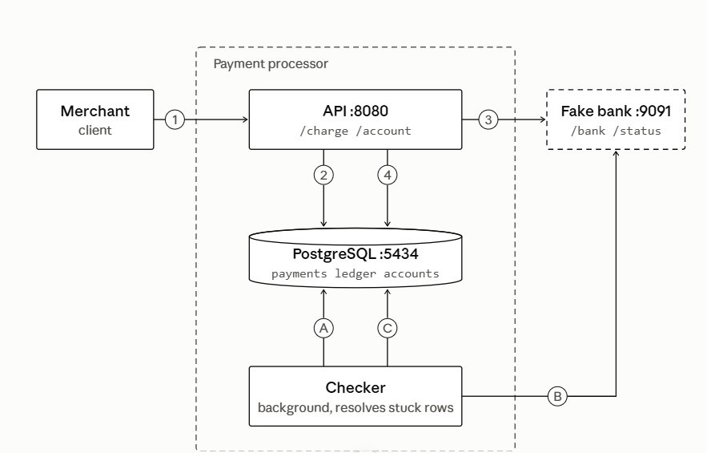

# payments-under-failure

A simulated payment processor, built to actually prove idempotency,
ledger correctness, and recovery from a real, injected process crash,
not just to write a charge API.

## Run it

```
docker compose up -d
psql "$DATABASE_URL" -f database/schema.sql

go run ./cmd/bank    # fake bank, port 9091
go run ./cmd/api     # API, port 8080
go run ./cmd/checker # run manually, or wire to a scheduler
```

Setting `DATABASE_URL` as an environment variable, not hardcoding
credentials, see `cmd/api/main.go` , `cmd/checker/main.go`

## First-time setup

The schema starts empty. Create a merchant and a customer before testing:

curl -X POST http://localhost:8080/account -d '{"account_type":"merchant","label":"Test Shop"}'

# copy the returned account_id

curl -X POST http://localhost:8080/account -d '{"account_type":"customer","external_ref":"cust-1","owner_merchant_id":"<merchant_id from above>"}'

# copy the returned account_id

Use these two IDs in place of merchant_id and customer_id in every
/charge example below.

## Results

132 process crashes injected on purpose, right after a payment is saved
and before the bank is ever contacted. 132 of 132 recovered correctly
by the background checker, zero duplicate charges, zero unbalanced
ledgers. Full numbers and the queries used to confirm them are in
[docs/results.md](docs/results.md).

## Architecture



## Failure scenarios handled

See the full table, all 15 edge cases, in
[docs/design.md](docs/design.md), section 5.

## Deliberately not built

Scoped out on purpose, to keep this focused on proving correctness
under failure first. Full reasoning in docs/design.md section 3.

- Payout, refunds, multi currency
- A customer facing UI, and webhooks
- Bank side idempotency on the charge endpoint (traced the actual call
  pattern and found it is not required given this design, documented
  as a real, open risk if that design ever changes)
- An automated CI test suite
- Cloud deployment and load testing against it

## Docs

- [docs/design.md](docs/design.md): the full design, every edge case,
  the alternatives considered and why they were not chosen, and the
  open questions I have not settled yet.
- [docs/results.md](docs/results.md): every number, and the exact
  queries used to confirm it.
- [docs/adr/](docs/adr/): short, individual records of specific
  decisions, each one left as it was written, only ever superseded by
  a new one, not edited after the fact.
